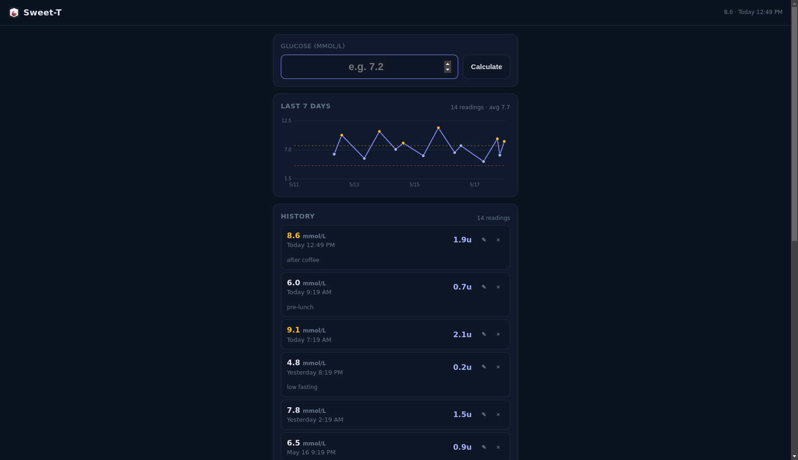

# Sweet-T

Lightweight glucose log + insulin calculator. Personal use, single device,
installable as a PWA, runs entirely in the browser.



## Insulin formula

Input is glucose in mmol/L. The calculator applies a piecewise rule:

```
mgdl = mmol * 18
insulin = mgdl > 100 ? (mgdl - 80) / 40 : mgdl / 40
```

Each saved reading records the raw mmol/L value, computed mg/dL, the
insulin recommendation, and `Date.now()` at save time.

## Stack

- Vanilla HTML / CSS / JS (no build step, no node_modules)
- IndexedDB for storage (origin-scoped, no auth, no cloud)
- Hand-rolled SVG line chart (7-day window)
- Service worker + Web App Manifest = installable, offline-capable PWA

## Running locally

```sh
python3 -m http.server 8765
# open http://127.0.0.1:8765/
```

## Deploy

Push to `main` and GitHub Pages auto-publishes the static site.

## Files

| Path | Purpose |
|---|---|
| `index.html` | UI shell |
| `app.js` | State, render, event wiring |
| `db.js` | IndexedDB CRUD wrapper |
| `chart.js` | SVG 7-day chart |
| `styles.css` | Mobile-first dark theme |
| `sw.js` | Service worker (cache-first shell) |
| `manifest.webmanifest` | PWA metadata |
| `icons/` | PWA icons (192, 512) |

## Data export

The Export CSV button downloads every reading with ISO timestamp,
mmol/L, mg/dL, insulin units, and notes.
